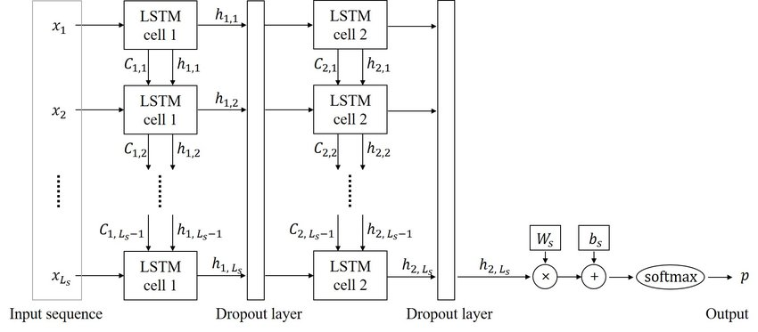
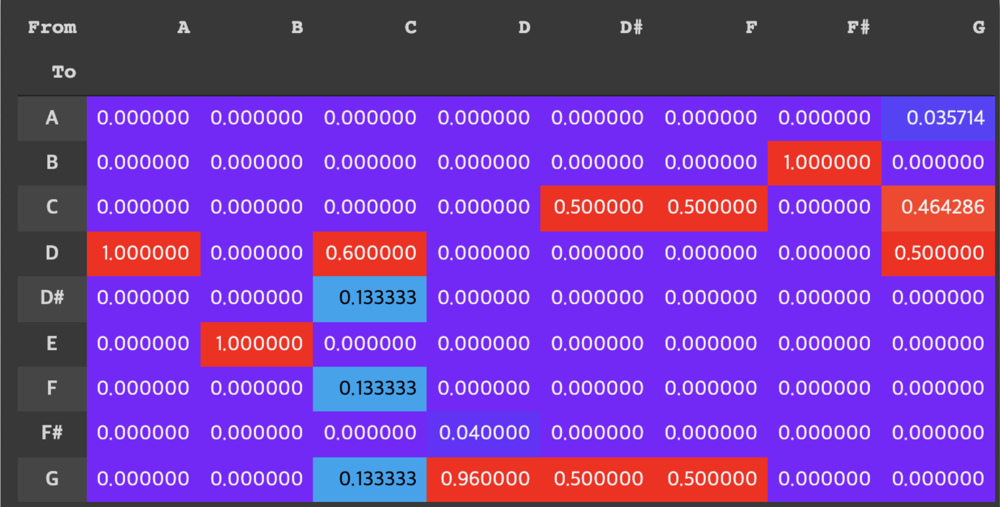
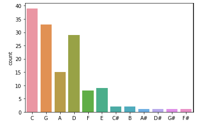
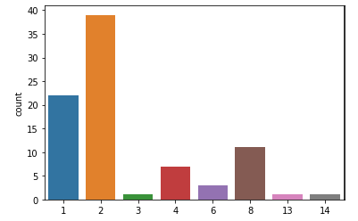
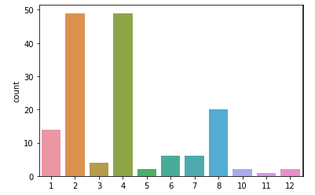

# Auto_Composition(Capstone design 2021-2)
Auto composition using stacked LSTM

[Iteration 16 (diversity : 1.2)](https://soundcloud.com/mezb0euz8jff/result-iter-16-div-1-20?si=8d1d3560e6044f40916fcc68e0bd468c)

[Iteration 35 (diversity : 1.2)](https://soundcloud.com/mezb0euz8jff/result-iter-35-div-1-20?si=a36c444bdc0a44bd8e1539b744902a87)

[Iteration 19 (diversity : 1.0)](https://soundcloud.com/mezb0euz8jff/result-iter-39-div-1-00?si=67fd7fb740a54cd184f7acc485b22bab)

## Overview

예술 분야에서도 머신러닝을 통해 새로운 창작물을 만들어낼 수 있을까 하는 호기심에서 시작해, 재즈라는 특정 음악 장르를 머신러닝을 통해 재즈의 특징을 잘 담아낼 수 있는 새로운 음악, 악보를 만들어내는 목표로 프로젝트를 진행합니다. 본 프로젝트에서는 LSTM을 통해 새로운 재즈 리얼북 악보를 생성하며, 예술 분야에서는 어떠한 평가 기준을 적용해 정량적으로 평가할 수 있는지를 고려해 성능 개선에 참고하게 됩니다. 

## Dataset

[Dataset](chord_sentences.txt)

모든 악보에 대해 C키로 이조하여 전처리 된 악보 데이터셋입니다. 매 악보의 시작과 끝에는 START와 END 태그가 붙으며, 연주되는 길이(Note Length)는 같은 코드를 여러 번 반복하는 것으로 표현합니다.

코드가 적힌 Word 하나(띄어쓰기 단위)는 한 박자를 의미합니다.

## Model

복잡성을 늘리기 위해 Multi Layer LSTM을 사용합니다. 이를 통해 단조로운 코드 진행을 막고, 더 다양한 코드를 사용한 곡을 만들 수 있게 해줍니다.

## Evaluation

[참조 논문(On the evaluation of generative models in music)](https://musicinformatics.gatech.edu/wp-content_nondefault/uploads/2018/11/postprint.pdf)

본 프로젝트에서는 3종류의 Metric을 사용합니다.

* Pitch Class Transition Matrix(PCTM)
* Pitch Class Histogram(PCH)
* Note Length Histogram(NLH)

3종류의 Metric을 통해 학습에 사용한 Dataset(진짜 재즈 악보 - 리얼북 코드)과 생성한 코드가 유사한 특성을 가지는지, 음악의 형식적인 규칙을 만족하는지를 평가하게 됩니다.

### 1. Pitch Class Transition Matrix(PCTM)

* Dataset

* Single Layer LSTM Result

* Multi Layer LSTM Result

재즈 장르에서는 II-V-I 진행이 높은 빈도로 나타나며, 해당 진행은 PCTM을 통해 확인할 수 있습니다.

위의 이미지처럼, `C - F - Bb - Eb - Ab - Db - Gb - B - E - A - D - G - C`의 사이클이 있고, 이 사이클의 순서로 코드가 바뀌면 II-V-I 진행이 나타난다고 볼 수 있습니다.

Transition Matrix를 통해 코드 변화의 빈도를 살펴보면, 붉은 색으로 칠해진 "자주 등장하는 코드 변환"은 대부분 II-V-I 진행임을 확인할 수 있습니다.
ex) A->D, B->E, D->G, E->A, G->C

Single Layer LSTM의 경우, II-V-I 진행은 눈에 띄지만 곡의 구성이 단조로움을 알 수 있습니다. 재즈의 특징을 잘 살림에는 분명하지만, 코드 변화가 너무 뻔하고 단조로워졌습니다.

따라서, 이를 보완하기 위해 Multi Layer LSTM을 통해 복잡도를 높였으며, Multi Layer LSTM으로 생성한 곡의 PCTM을 보면 Single Layer보다 더 다양한 코드가 쓰였음을 확인할 수 있습니다.

### 2. Pitch Class Histogram(PCH)

* Dataset

* Single Layer LSTM Result

* Multi Layer LSTM Result

Pitch Class Histogram(PCH)를 통해서, D, C, G 코드가 재즈에서 많이 등장하는 코드라는 사실을 알 수 있으며, 새로 생성해준 악보에서도 D, C, G 코드가 자주 나타나는 경향을 확인할 수 있습니다.

### 3. Note Length Histogram(NLH)

* Dataset

* Single Layer LSTM Result

* Multi Layer LSTM Result

Note Length Histogram(NLH)를 통해서는 생성한 곡이 음악적인 형식을 갖추고 있는지를 확인할 수 있습니다.

4분의 4박자 기준의 데이터로 학습을 진행했기 때문에, 4박자를 기준으로 코드 진행이 이뤄지게 됩니다. 이에 따라 박자가 형식에 맞는다면, NLH를 살펴보았을 때 자연스럽게 2^n 크기의 노트가 더 자주 등장하게 된다는 사실을 알 수 있습니다.

## Conclusion

LSTM을 통해 새로운 재즈 악보를 생성해 보았습니다. 실제로 나온 악보를 보고 연주를 해보면, 나온 멜로디의 코드 진행은 얼핏 듣기에도 꽤 괜찮은 코드 진행으로 들립니다.

뿐만 아니라, 4박자를 기준으로 딱 맞아 떨어지는 코드 진행을 보여주며 형식적으로도 완성도있는 곡이 만들어지고 있다는 느낌을 줍니다.

앞으로 재즈 뿐만 아니라 다양한 음악 장르에, 음악 분야 뿐만 아니라 다양한 예술 분야에서도 머신 러닝이 활용될 수 있을 것 같은 기대감이 듭니다.

다만, 아쉬운 점은 이번엔 코드의 진행으로 대략적인 곡의 흐름만을 잡아보았다는 점입니다. 추후, 코드에 따라 멜로디를 생성해주거나 드럼 비트나 여러가지 악기들이 한꺼번에 같이 연주할 수 있도록 하면 더 재미있을 것 같다는 생각이 들었습니다. 
